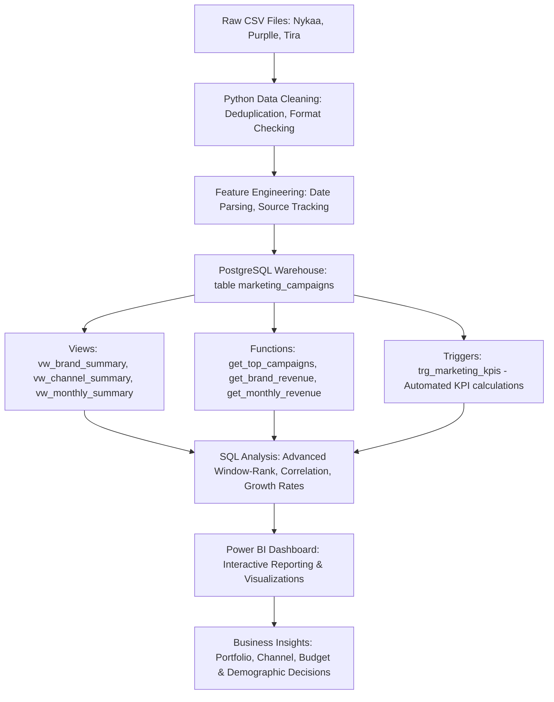
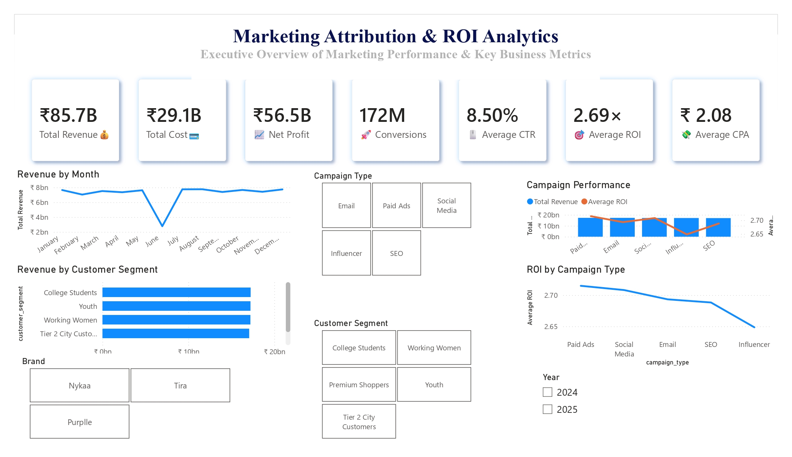
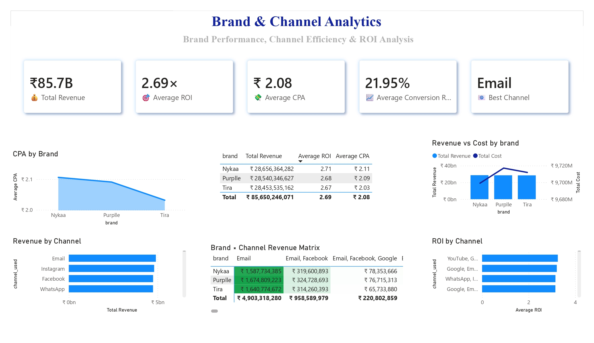
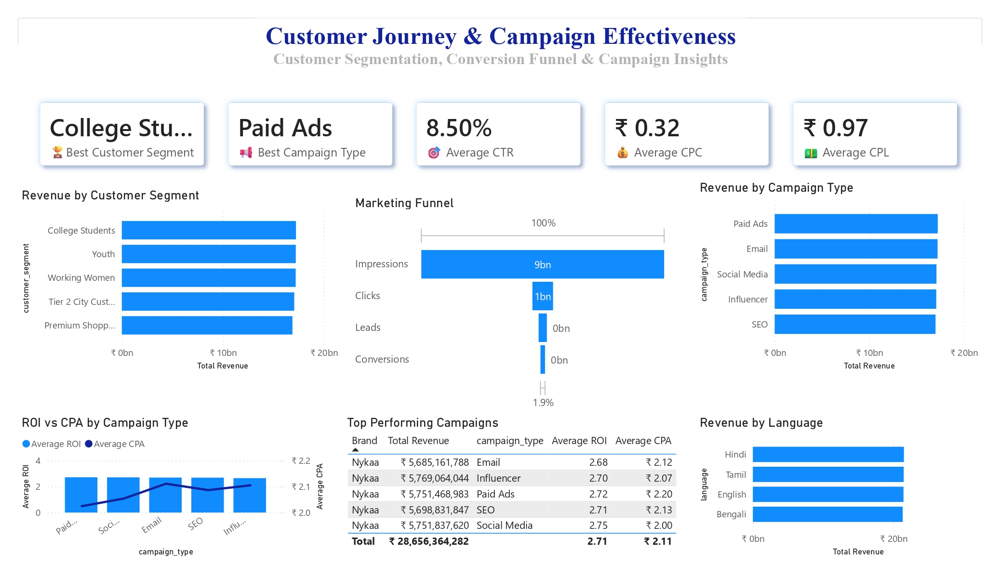
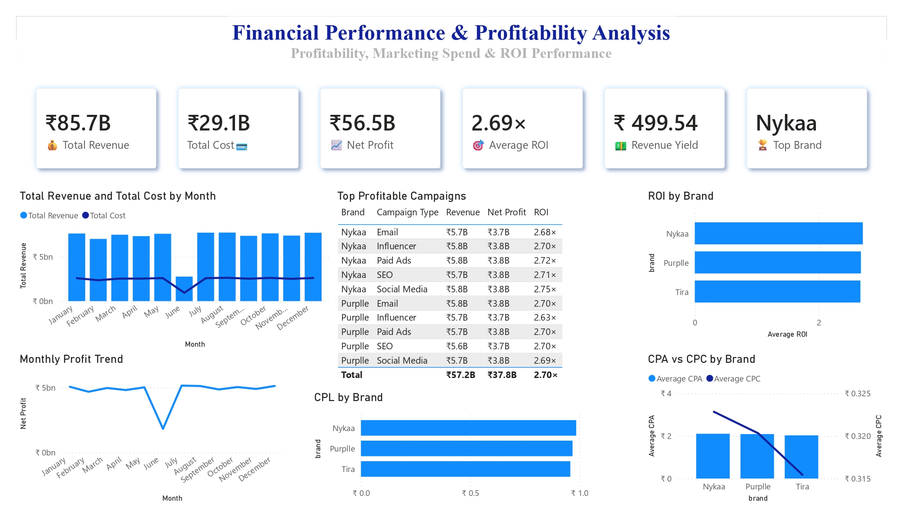
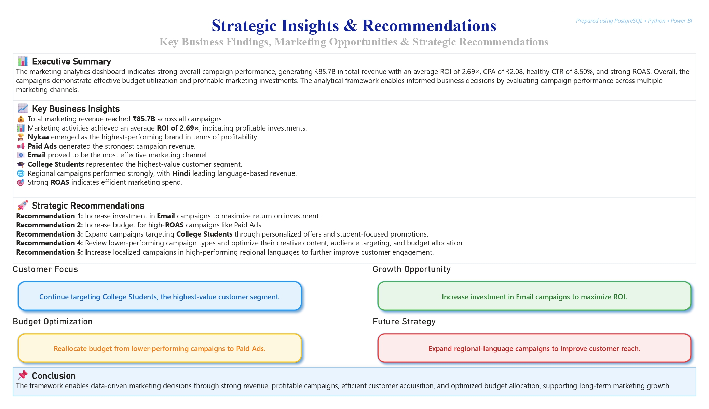
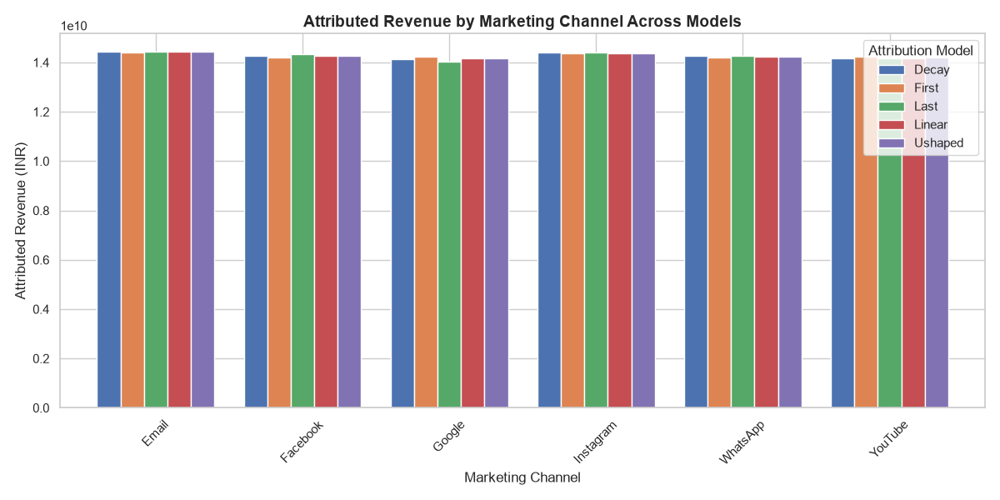
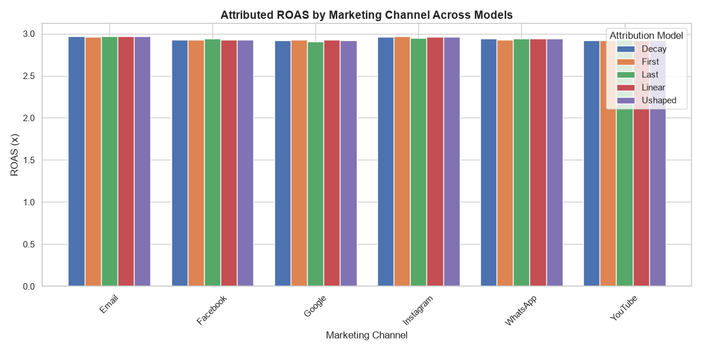
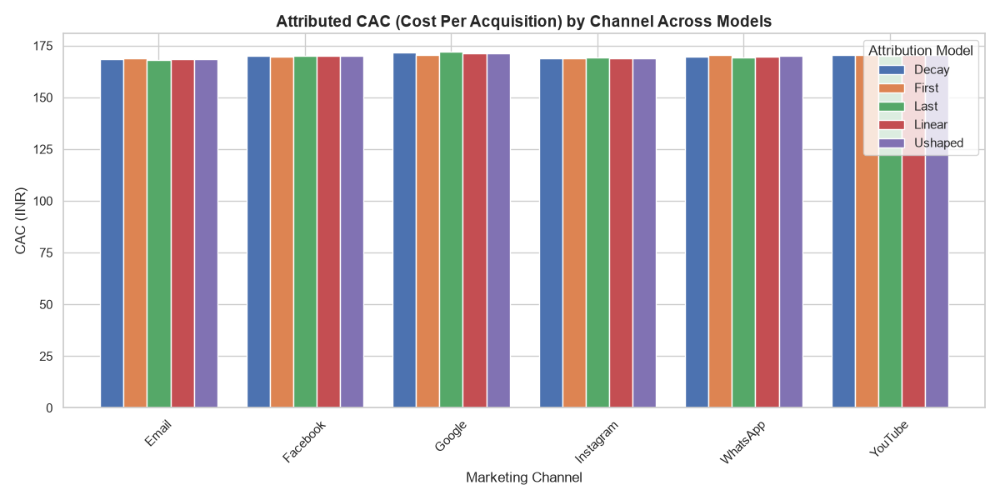

# Marketing Attribution & Campaign Analytics Portfolio

An enterprise-grade marketing analytics and business intelligence solution. This repository consolidates, cleans, and analyzes campaign records across three major Indian beauty retail brands—**Nykaa**, **Purplle**, and **Tira**—to optimize marketing attribution, ROI, and customer acquisition costs.

---

## 📊 Project Statistics
*   **166,665** Campaign Records
*   **3** Indian Beauty Brands (Nykaa, Purplle, Tira)
*   **156** Unique Marketing Channel Configurations
*   **5** Simulated Attribution Models
*   **37** Analytical SQL Queries
*   **5** Interactive Power BI Pages
*   **PostgreSQL + Python + Power BI** End-to-End Pipeline

---

## 🏗️ End-to-End System Architecture

---

## 🚀 Key Features
*   **Enterprise PostgreSQL Data Warehouse:** Safe DDL schema initialization with data integrity constraints, column-level metadata, and index optimizations.
*   **Automated KPI Trigger Pipeline:** PL/pgSQL database triggers to automatically compute CTR, Conversion Rate, CPC, CPL, and CPA on inserts/updates.
*   **37 Advanced SQL Analytics Queries:** Catalog of parametric business reports, growth mapping, and window-ranking queries.
*   **5-Page Interactive Power BI Dashboard:** Clean star-schema model with corrected financial logic, dynamic slicers, and performance analysis.
*   **Multi-Touch Attribution Simulation:** Python ETL scripts comparing First Touch, Last Touch, Linear, Time-Decay, and U-Shaped weights.
*   **Financial KPI Framework:** Balanced portfolio analysis using true marketing spend to calculate ROI, ROAS, CPA, CPC, and CPL.
*   **Exploratory Data Science Notebooks:** Python profiling, brand summaries, and seasonality analyses.

---

## 📈 Business Value
This analytics framework enables organizations to:
*   **Optimize Marketing Budget Allocation:** Identify underperforming campaign formats and shift spend toward high-ROAS channels.
*   **Evaluate Brand Portfolio Performance:** Contrast campaign effectiveness across Nykaa, Purplle, and Tira portfolios.
*   **Simulate Attribution Strategy Shifts:** Assess how channel credit shifts when moving from traditional Last-Touch to multi-touch linear or time-decay models.
*   **Analyze Customer Cohorts:** Profile demographic responses (e.g. college students, youth) to localize marketing efforts.
*   **Maintain Financial KPI Control:** Track accurate cost efficiency (CPC, CPL, CPA) and ROI at the individual channel level.

---

## 📂 Project Navigation

The project is structured into three primary analytical layers:

### 1. Data Processing & Exploratory Notebooks
*   **Location:** [`python/`](python/)
*   **Pipeline Steps:**
    *   [01_Data_Loading.ipynb](python/01_Data_Loading.ipynb) - Ingestion & concatenation.
    *   [02_Data_Cleaning.ipynb](python/02_Data_Cleaning.ipynb) - Data auditing & base KPIs.
    *   [03_EDA.ipynb](python/03_EDA.ipynb) - Brand & demographic profiling.
    *   [04_KPI_Analysis.ipynb](python/04_KPI_Analysis.ipynb) - Channel and strategy analysis.
    *   [05_Final_Insights.ipynb](python/05_Final_Insights.ipynb) - Seasonality trends, correlation, and recommendations.

### 2. Analytical Database Warehouse (PostgreSQL)
*   **Location:** [`sql/`](sql/)
*   **Core Scripts:**
    *   [database.sql](sql/database.sql) - Safe database initialization.
    *   [create_table.sql](sql/create_table.sql) - Schema with checks & indexes.
    *   [import_data.sql](sql/import_data.sql) - Ingestion commands.
    *   [views.sql](sql/views.sql) - Business intelligence views.
    *   [functions.sql](sql/functions.sql) - Parametric reporting functions.
    *   [triggers.sql](sql/triggers.sql) - Automated KPI computation trigger.
    *   [analysis_queries.sql](sql/analysis_queries.sql) - Catalog of 37 SQL reporting queries.
    *   Refer to [README_SQL.md](sql/README_SQL.md) for detailed database documentation.

### 3. Business Intelligence & Star Schema
*   **Location:** [`data/star_schema/`](data/star_schema/)
*   **Details:**
    *   Features the central `fact_marketing_campaigns.csv` and six dimension tables (`dim_brand.csv`, `dim_channel.csv`, `dim_campaign_type.csv`, `dim_customer_segment.csv`, `dim_language.csv`, `dim_date.csv`) generated with integer surrogate keys.
    *   Refer to [README_STAR_SCHEMA.md](data/star_schema/README_STAR_SCHEMA.md) for the entity relationship model and descriptions.

### 4. Interactive Power BI Dashboard
*   **Location:** [`dashboard/`](dashboard/)
*   **File:** [Marketing-Attribution-ROI-Analytics.pbix](dashboard/Marketing-Attribution-ROI-Analytics.pbix)
*   **Details:** Built using Microsoft Power BI Desktop, implementing a clean star-schema model, custom DAX metrics, and responsive visual layout. It contains five key reports:
    
#### 📊 1. Executive Overview
Provides high-level KPIs (Total Revenue, Average ROI, CPA, CTR) and maps performance over time, by brand, and by customer segment.

#### 🏢 2. Brand & Channel Analytics
Drills down into brand portfolio comparison (Nykaa, Purplle, Tira) and marketing channel performance (Email, Paid Ads, Social Media, etc.) with detailed matrices.

#### 🎯 3. Customer Journey & Campaign Effectiveness
Visualizes the marketing funnel conversion rates (Impressions -> Clicks -> Leads -> Conversions) along with performance by language and target audience segment.

#### 💰 4. Financial Performance & Profitability Analysis
A deep-dive financial dashboard displaying profit trends, CPL, CPA vs. CPC metrics, and campaign ROI tracking.

#### 💡 5. Strategic Insights & Recommendations
Summarizes key business findings and lists automated strategic recommendations mapped to budget optimization, customer focus, and future growth strategy.

### 5. Analytical Framework & Business Report
*   **Location:** [`report/`](report/)
*   **Files:** 
    *   [MARKETING ANALYTICS FRAMEWORK, ATTRIBUTION METHODOLOGY & BUSINESS JUSTIFICATION.pdf](report/MARKETING%20ANALYTICS%20FRAMEWORK,%20ATTRIBUTION%20METHODOLOGY%20&%20BUSINESS%20JUSTIFICATION.pdf) - 25-page comprehensive business documentation detailing the core framework.
    *   [ATTRIBUTION_MODELING_&_FINANCIAL_KPI_SUPPLEMENT.md](report/ATTRIBUTION_MODELING_&_FINANCIAL_KPI_SUPPLEMENT.md) - Business appendix detailing the corrected financial formulas, DAX measures, and multi-touch attribution comparisons (First Touch, Last Touch, Linear, Time-Decay, U-Shaped).

### 6. Marketing Attribution Simulation Results (Python)
*   **Location:** [`python/`](python/)
*   **Details:** We simulated First-Touch, Last-Touch, Linear, Time-Decay, and U-Shaped attribution weights in [06_Attribution_Modeling.ipynb](python/06_Attribution_Modeling.ipynb) to compare channel performance. Visual results:
    
#### 📈 1. Attributed Revenue Comparison

#### 🎯 2. Attributed ROAS Comparison

#### 💰 3. Attributed CAC Comparison

---

## ⚡ Skills Demonstrated
*   **Data Pipelines:** ETL, data ingestion, cleaning, and concatenation in Pandas.
*   **SQL Architecture:** DDL schema design, PL/pgSQL database triggers, stored procedures, indexing optimizations, and query compilation.
*   **Business Intelligence & DAX:** Star schema design, dimensional modeling, custom DAX metrics, and interactive dashboard mockups.
*   **Marketing Attribution Modeling:** Design, simulation, and comparison of First Touch, Last Touch, Linear, Time-Decay, and U-Shaped (position-based) attribution methodologies.
*   **Advanced Analytics:** ROAS calculations, CAC/CPA financial mapping, Customer Lifetime Value (CLV) baseline estimation, statistical correlation, and cohort analysis.

---

## 📄 License
This project is licensed under the MIT License - see the [LICENSE](LICENSE) file for details.

---

## ✉️ Contact
**Author:** Akshansh Vijay  
**LinkedIn:** [Akshansh Vijay](https://www.linkedin.com/in/akshansh-vijay/)  
**GitHub:** [akshanshvj](https://github.com/akshanshvj)  
**Email:** [akshanshvj4803@gmail.com](mailto:akshanshvj4803@gmail.com)

