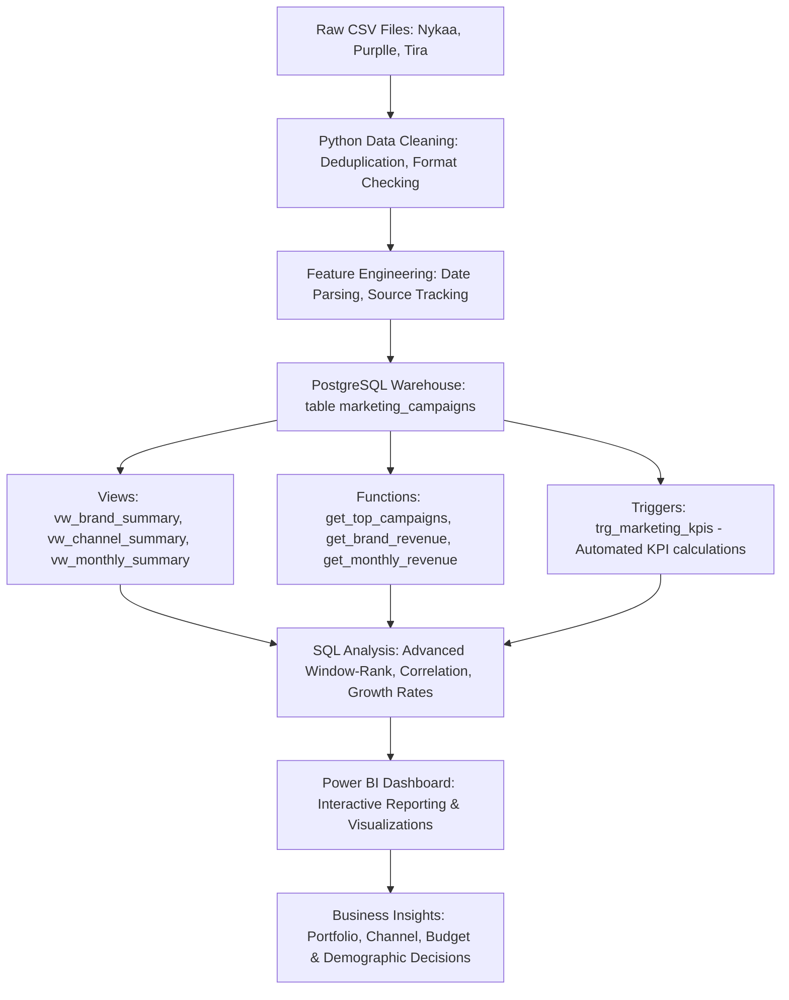

# Marketing Attribution & Campaign Analytics Portfolio

An enterprise-grade marketing analytics and business intelligence solution. This repository consolidates, cleans, and analyzes campaign records across three major Indian beauty retail brands—**Nykaa**, **Purplle**, and **Tira**—to optimize marketing attribution, ROI, and customer acquisition costs.

---

## 🏗️ End-to-End System Architecture

---

## 📂 Project Navigation

The project is structured into three primary analytical layers:

### 1. Data Processing & Exploratory Notebooks
*   **Location:** [`python/`](python/)
*   **Pipeline Steps:**
    *   [01_Data_Loading.ipynb](python/01_Data_Loading.ipynb) - Ingestion & concatenation.
    *   [02_Data_Cleaning.ipynb](python/02_Data_Cleaning.ipynb) - Data auditing & base KPIs.
    *   [03_EDA.ipynb](python/03_EDA.ipynb) - Brand & demographic profiling.
    *   [04_KPI_Analysis.ipynb](python/04_KPI_Analysis.ipynb) - Channel and strategy analysis.
    *   [05_Final_Insights.ipynb](python/05_Final_Insights.ipynb) - Seasonality trends, correlation, and recommendations.

### 2. Analytical Database Warehouse (PostgreSQL)
*   **Location:** [`sql/`](sql/)
*   **Core Scripts:**
    *   [database.sql](sql/database.sql) - Safe database initialization.
    *   [create_table.sql](sql/create_table.sql) - Schema with checks & indexes.
    *   [import_data.sql](sql/import_data.sql) - Ingestion commands.
    *   [views.sql](sql/views.sql) - Business intelligence views.
    *   [functions.sql](sql/functions.sql) - Parametric reporting functions.
    *   [triggers.sql](sql/triggers.sql) - Automated KPI computation trigger.
    *   [analysis_queries.sql](sql/analysis_queries.sql) - Catalog of 47 SQL reporting queries.
    *   Refer to [README_SQL.md](sql/README_SQL.md) for detailed database documentation.

### 3. Business Intelligence & Star Schema
*   **Location:** [`data/star_schema/`](data/star_schema/)
*   **Details:**
    *   Features the central `fact_marketing_campaigns.csv` and six dimension tables (`dim_brand.csv`, `dim_channel.csv`, `dim_campaign_type.csv`, `dim_customer_segment.csv`, `dim_language.csv`, `dim_date.csv`) generated with integer surrogate keys.
    *   Refer to [README_STAR_SCHEMA.md](data/star_schema/README_STAR_SCHEMA.md) for the entity relationship model and descriptions.

---

## ⚡ Skills Demonstrated
*   **Data Pipelines:** ETL, data ingestion, cleaning, and concatenation in Pandas.
*   **SQL Architecture:** DDL schema design, PL/pgSQL database triggers, stored procedures, indexing optimizations, and query compilation.
*   **Business Intelligence:** Star schema design, dimensional modeling, DAX measurements, and interactive layout mockups.
*   **Advanced Analytics:** Statistical correlation, outlier detection, seasonality mapping, and cohort analysis.

---

## 📄 License
This project is licensed under the MIT License - see the [LICENSE](#) file for details.

---

## ✉️ Contact
**Author:** Akshansh Vijay  
**LinkedIn:** [LinkedIn Profile Placeholder](#)  
**GitHub:** [GitHub Profile Placeholder](#)  
**Email:** [Email Placeholder](#)
