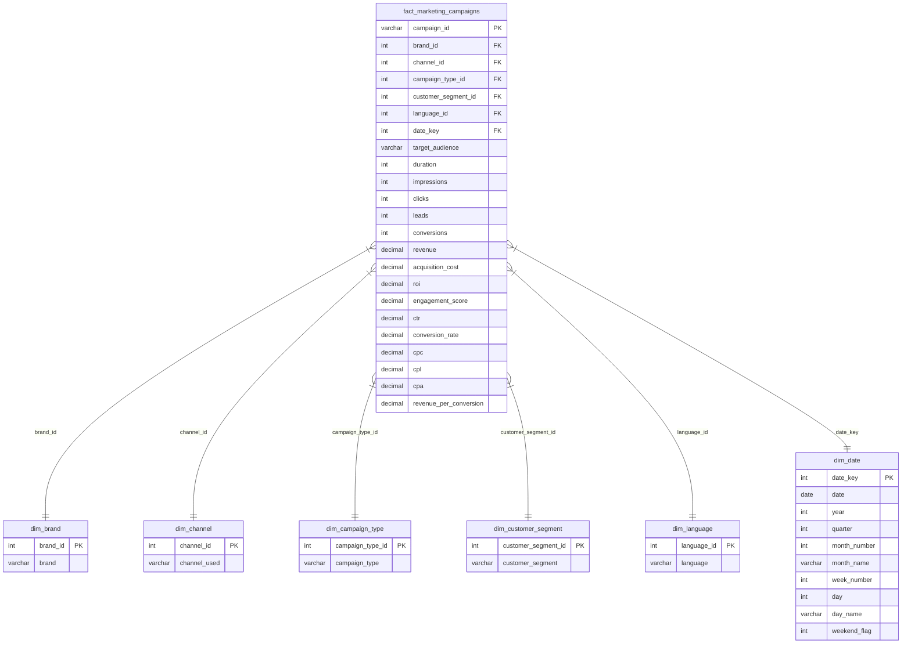

# Power BI Star Schema Data Model

This directory contains the star schema tables generated from the cleaned marketing campaign dataset, optimized for direct loading into Power BI.

---

## 🏗️ Schema Overview

The schema is structured as a **Star Schema** with one central fact table and six supporting dimension tables. Surrogate keys have been generated for each dimension, and all text descriptors in the fact table have been replaced with these integer keys to improve BI join performance.

---

## 🗂️ Tables Summary

### 1. `fact_marketing_campaigns`
*   **Description:** The central transaction table containing numerical measurements (impressions, clicks, conversions, revenue, cost) and metric ratios (CTR, CPA, ROI), mapped to dimensions via surrogate keys.
*   **Row Count:** 166,665
*   **Column Count:** 23

### 2. `dim_brand`
*   **Description:** Brand portfolio details (Nykaa, Purplle, Tira).
*   **Row Count:** 3
*   **Column Count:** 2

### 3. `dim_channel`
*   **Description:** Bidding channels and multi-channel configurations (e.g. Email, Instagram, Facebook + combos).
*   **Row Count:** 156
*   **Column Count:** 2

### 4. `dim_campaign_type`
*   **Description:** Campaign strategy classifications (Paid Ads, Social Media, Influencer, SEO, Email).
*   **Row Count:** 5
*   **Column Count:** 2

### 5. `dim_customer_segment`
*   **Description:** Buyer demographic segments (College Students, Youth, Working Women, Premium Shoppers, Tier 2 City Customers).
*   **Row Count:** 5
*   **Column Count:** 2

### 6. `dim_language`
*   **Description:** localized languages utilized in copy (Bengali, English, Hindi, Tamil).
*   **Row Count:** 4
*   **Column Count:** 2

### 7. `dim_date`
*   **Description:** The calendar dimension generated dynamically from the date boundaries in the raw logs.
*   **Attributes:** Date, Year, Quarter, Month Number, Month Name, Week Number, Day, Day Name, Weekend Flag.
*   **Row Count:** 359
*   **Column Count:** 10
