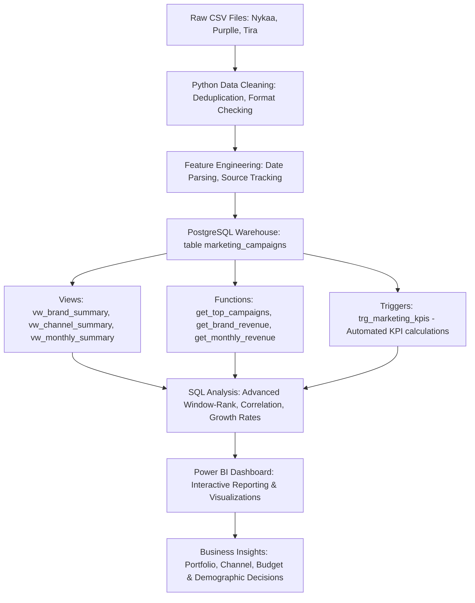
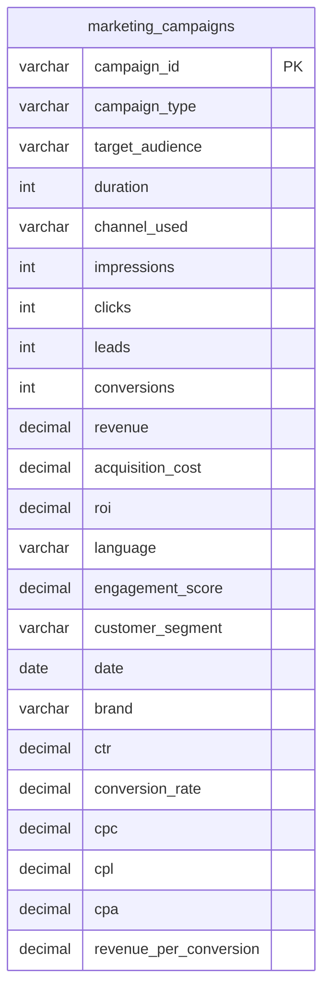

# Marketing Attribution & Campaign Analytics: Enterprise SQL Warehouse

[](https://www.postgresql.org/)
[](https://www.python.org/)
[](https://powerbi.microsoft.com/)
[](https://jupyter.org/)
[](#)
[](#)
[](https://opensource.org/licenses/MIT)
[](https://github.com/)

## 📋 Project Overview
This SQL repository constitutes the data warehouse layer for the **Marketing Attribution & Campaign Analytics** portfolio project. It integrates marketing campaign records from three cosmetic retail platforms in India: **Nykaa**, **Purplle**, and **Tira**.

The database schema is optimized for analytical reporting and decision support, containing structured tables, business intelligence views, PL/pgSQL stored reporting functions, and automated metadata calculators (triggers) built natively for **PostgreSQL**.

---

## 🏗️ Project Architecture

The database lifecycle and reporting funnels flow through the following warehouse architecture:



---

## 📊 Dataset Overview

Prior to database ingestion, the campaign dataset was cleaned, formatted, and enriched using Python (Jupyter Notebooks).

| Dimension / Metric | Value |
| :--- | :--- |
| **Total Records (Rows)** | 166,665 |
| **Total Columns** | 23 (including 6 engineered KPIs) |
| **Brands Represented** | 3 (Nykaa, Purplle, Tira) |
| **Campaign Types** | 5 (Paid Ads, Social Media, Influencer, SEO, Email) |
| **Marketing Channels** | 156 unique configurations (single & multi-channel setups) |
| **Customer Segments** | 5 (College Students, Youth, Working Women, Premium Shoppers, Tier 2 City Customers) |
| **Languages Represented** | 4 (Hindi, Tamil, English, Bengali) |
| **Date Range** | July 1, 2024, to June 30, 2025 |
| **Engineered KPIs** | 6 (`CTR`, `Conversion_Rate`, `CPC`, `CPL`, `CPA`, `Revenue_Per_Conversion`) |

---

## 📂 Project Folder Structure

The repository is structured to separate concern and support production analytical models:

```text
Marketing-Attribution-Analytics/
├── data/
│   ├── nykaa_campaign_data.csv        # Raw campaign logs (Nykaa)
│   ├── purplle_campaign_data.csv      # Raw campaign logs (Purplle)
│   ├── tira_campaign_data.csv         # Raw campaign logs (Tira)
│   ├── marketing_raw_merged.csv       # Raw merged campaign data
│   └── marketing_data_cleaned.csv     # Cleaned, KPI-enriched dataset
├── python/
│   ├── 01_Data_Loading.ipynb          # Raw ingestion & merging
│   ├── 02_Data_Cleaning.ipynb         # Quality verification & base KPIs
│   ├── 03_EDA.ipynb                   # Brand & demographic exploration
│   ├── 04_KPI_Analysis.ipynb          # Channel & campaign strategy analysis
│   └── 05_Final_Insights.ipynb        # Trends, outliers, and recommendations
├── sql/
│   ├── README_SQL.md                  # Database documentation (this file)
│   ├── database.sql                   # Database initialization
│   ├── create_table.sql               # Table schema & indexes
│   ├── import_data.sql                # Data COPY/psql import commands
│   ├── views.sql                      # Analytical reporting views
│   ├── functions.sql                  # PL/pgSQL reporting functions
│   ├── triggers.sql                   # PL/pgSQL trigger for KPI automation
│   └── analysis_queries.sql           # Query catalog (47 SQL scripts)
├── dashboard/                         # Dashboards & visual source code
├── report/                            # PDF / markdown analysis reports
├── presentation/                      # Portfolio presentation slide deck
├── images/                            # Project images and screenshots
└── README.md                          # Global repository readme
```

---

## 🛠️ SQL Feature Summary

| Component | Features Demonstrated | Count |
| :--- | :--- | :--- |
| **Tables** | Primary Key, check constraints, schema documentation. | 1 |
| **Views** | Aggregated reports for brands, channels, monthly trends, and performance. | 4 |
| **Functions** | Stored PL/pgSQL functions returning tables with dynamic query filtering. | 4 |
| **Triggers** | Event-driven `BEFORE INSERT OR UPDATE` trigger for automated KPI generation. | 1 |
| **Window Functions**| `ROW_NUMBER()`, `RANK()`, `DENSE_RANK()`, `LAG()`, `LEAD()`, `NTILE()`, `PERCENT_RANK()`. | Extensive |
| **CTEs** | Multi-level subquery factoring for monthly trends, market share, and growth checks. | Extensive |
| **Indexes** | B-Tree single-column, compound columns (`brand` & `date`), type + ROI rankings. | 6 |
| **Constraints** | `NOT NULL`, `PRIMARY KEY`, check constraints (`>=0`, `>0` for durations). | 14 |

---

## 🗃️ Database Schema ERD

The database consists of a central flat-table data warehouse model, optimized for star-schema read efficiency and denormalized query performance.



---

## 📝 Table Description: `marketing_campaigns`

| Column | Data Type | Constraints | Description |
| :--- | :--- | :--- | :--- |
| `campaign_id` | `VARCHAR(50)` | `PRIMARY KEY` | Unique campaign run identifier (e.g. `NY-CMP-1000`). |
| `campaign_type` | `VARCHAR(50)` | `NOT NULL` | Campaign strategy category (e.g., Paid Ads, SEO, Influencer). |
| `target_audience` | `VARCHAR(100)` | `NOT NULL` | Creative cohort targeted (e.g., Premium Shoppers, Youth). |
| `duration` | `INT` | `NOT NULL, CHECK (>0)` | Lifespan of the campaign in days. |
| `channel_used` | `VARCHAR(255)` | `NOT NULL` | Social/ad network platforms utilized. Supports multi-channel lists. |
| `impressions` | `INT` | `NOT NULL, CHECK (>=0)`| Aggregate creative displays driven. |
| `clicks` | `INT` | `NOT NULL, CHECK (>=0)`| Aggregate click responses driven. |
| `leads` | `INT` | `NOT NULL, CHECK (>=0)`| Aggregate pipeline leads generated. |
| `conversions` | `INT` | `NOT NULL, CHECK (>=0)`| Aggregate purchases driven. |
| `revenue` | `DECIMAL(15,2)` | `NOT NULL, CHECK (>=0.00)` | Gross sales revenue driven by campaign (INR). |
| `acquisition_cost`| `DECIMAL(15,2)` | `NOT NULL, CHECK (>=0.00)` | Gross marketing spend on the campaign (INR). |
| `roi` | `DECIMAL(12,4)` | `NOT NULL` | Return on Investment multiplier. (Net Profit / Spend). |
| `language` | `VARCHAR(50)` | `NOT NULL` | Language utilized in ad copy (e.g., Hindi, Tamil, English). |
| `engagement_score`| `DECIMAL(5,2)` | `NOT NULL, CHECK (>=0)`| Consolidated audience engagement score. |
| `customer_segment`| `VARCHAR(100)` | `NOT NULL` | Buyer demographic segment classification. |
| `date` | `DATE` | `NOT NULL` | Execution date of the campaign. |
| `brand` | `VARCHAR(50)` | `NOT NULL` | Source brand catalog (Nykaa, Purplle, Tira). |
| `ctr` | `DECIMAL(10,6)` | `NOT NULL, CHECK (>=0)`| Click-Through Rate. Automatically computed by trigger. |
| `conversion_rate` | `DECIMAL(10,6)` | `NOT NULL, CHECK (>=0)`| Conversion Rate. Automatically computed by trigger. |
| `cpc` | `DECIMAL(15,6)` | `NOT NULL, CHECK (>=0)`| Cost Per Click (INR). Automatically computed by trigger. |
| `cpl` | `DECIMAL(15,6)` | `NOT NULL, CHECK (>=0)`| Cost Per Lead (INR). Automatically computed by trigger. |
| `cpa` | `DECIMAL(15,6)` | `NOT NULL, CHECK (>=0)`| Cost Per Acquisition (INR). Automatically computed by trigger. |
| `revenue_per_conversion` | `DECIMAL(15,6)` | `NOT NULL, CHECK (>=0)`| Gross Revenue Per Conversion. Automatically computed by trigger. |

---

## ⚡ Performance Optimization

To ensure fast query response times across large-scale analytical datasets (e.g., 166,665 rows in our marketing schema), we implemented database indexing designed specifically for grouping and sorting operations:

*   **`idx_campaigns_brand`**: Accelerates partition filters by brand.
*   **`idx_campaigns_date`**: Optimizes chronological sorting and time-series date filters.
*   **`idx_campaigns_type`**: Speeds up campaign category grouping.
*   **`idx_campaigns_segment`**: Speeds up demographic cohort slice-and-dice queries.
*   **`idx_campaigns_brand_date`** (Compound B-Tree): Essential for brand trend charts, speeding up simultaneous brand filtering and date sorting.
*   **`idx_campaigns_type_roi`** (Compound B-Tree + Descending): Speeds up ranking and filtering for the best-performing campaign categories (where `roi` is sorted descending).

---

## 📊 Analytical Views

Reporting views are available in **[views.sql](views.sql)**:

1.  **`vw_brand_summary`**: Provides high-level portfolio KPIs (Revenue, Cost, ROI, CTR, Conversion Rate, and average CPA) grouped by brand.
2.  **`vw_channel_summary`**: Aggregates conversion metrics, CPC, and ROI across all marketing channels.
3.  **`vw_monthly_summary`**: Summarizes monthly chronological performance for timeline analytics.
4.  **`vw_campaign_performance`**: Detailed campaign listing containing attribution variables.

---

## ⚙️ Stored Functions

Analytical parametric reporting functions are available in **[functions.sql](functions.sql)**:

1.  **`get_top_campaigns(limit_count integer)`**: Returns the top N campaigns by gross revenue.
2.  **`get_brand_revenue(brand_name text)`**: Returns monthly chronological revenue and conversions for a specified brand.
3.  **`get_monthly_revenue(month_input date)`**: Returns all campaigns that ran during a specific month, sorted by revenue.
4.  **`get_best_channels(limit_count integer)`**: Returns the top N channels ranked by average ROI.

---

## 🔌 Database Triggers

Automatic KPI engineering is managed via the triggers defined in **[triggers.sql](triggers.sql)**:

*   **Trigger function (`fn_calculate_campaign_kpis()`)**: Automatically calculates CTR, Conversion Rate, CPC, CPL, CPA, and Revenue Per Conversion before writing to the database.
*   **Divide-by-zero protection**: Safely checks for zero inputs in the divisor and sets the corresponding KPI output to `0.00` to prevent runtime query failures.
*   **Bidding trigger (`trg_marketing_kpis`)**: Automatically triggers for `BEFORE INSERT OR UPDATE` operations.

---

## 📥 How to Import Data

1.  Initialize the database catalog and tables:
    ```bash
    psql -U postgres -f sql/database.sql
    psql -U postgres -d marketing_db -f sql/create_table.sql
    ```
2.  Install views, triggers, and functions:
    ```bash
    psql -U postgres -d marketing_db -f sql/triggers.sql
    psql -U postgres -d marketing_db -f sql/views.sql
    psql -U postgres -d marketing_db -f sql/functions.sql
    ```
3.  Stream and copy the cleaned CSV data:
    Ensure you run the command from the repository root:
    ```bash
    psql -U postgres -d marketing_db -c "\copy marketing_campaigns FROM 'data/marketing_data_cleaned.csv' WITH (FORMAT csv, HEADER true, ENCODING 'utf-8', DELIMITER ',')"
    ```

---

## 🖥️ How to Execute Queries

Queries are compiled in **[analysis_queries.sql](analysis_queries.sql)**. You can run them using psql:
```bash
psql -U postgres -d marketing_db -f sql/analysis_queries.sql
```
For interactive exploration, log into the db:
```bash
psql -U postgres -d marketing_db
```
Example test calls for views & functions:
```sql
SELECT * FROM vw_brand_summary;
SELECT * FROM get_top_campaigns(5);
SELECT * FROM get_brand_revenue('Nykaa');
```

---

## 📊 Power BI Dashboard Integration

The PostgreSQL analytics warehouse acts as the primary data source for the **Marketing Attribution & Campaign Analytics Dashboard** built in Power BI. 

### Visualizations Powered by SQL Schemas:
*   **KPI Scorecards:** Displays high-level summaries of Revenue, ROI, CTR, and CPA.
*   **Brand Performance Visuals:** Column charts comparing Nykaa, Purplle, and Tira portfolios.
*   **Monthly Seasonality Trends:** Line graphs tracking Revenue and Conversions to identify Diwali and holiday spikes.
*   **Channel Bidding Analytics:** Bar charts displaying top-performing single and multichannel configurations.
*   **Customer Segment Profiling:** Demographic visual slices detailing Student vs. Working Women segments.
*   **Budget Allocation Optimization:** Interactive recommendations to shift budgets from underperforming single channels (YouTube) to high-yield multichannel configurations.

*(Placeholder: Add Dashboard Screenshot Here)*

---

## 🚀 Roadmap & Future Enhancements

*   **Containerization (Docker):** Bundle PostgreSQL and Jupyter environments into Docker containers for easy local deployment.
*   **Workflow Orchestration (Apache Airflow):** Automate data integration pipelines to run raw loading, deduplication, and cleaning scripts.
*   **Analytical Modeling (dbt Models):** Transition raw tables to analytical warehouse schemas using dbt (Data Build Tool) for modular testing.
*   **Materialized Views:** Implement materialized views with refresh strategies to speed up complex queries.
*   **Incremental Loading:** Set up delta loading to process daily campaign updates without reprocessing the entire dataset.
*   **CI/CD Pipeline:** Implement GitHub Actions to test SQL query syntax on new commits.
*   **Cloud Data Platform:** Scale the repository to cloud architectures like Snowflake, Azure SQL, or Google BigQuery.

---

## 🧠 Skills Demonstrated
*   **Analytical Schema Design:** Creating structured tables with index optimizations and check constraints.
*   **PL/pgSQL stored routines:** Parametric tables retrieval functions and secure procedure encapsulation.
*   **Event-Driven Triggers:** Automating pipeline calculations and managing divide-by-zero protection directly in database engine.
*   **PostgreSQL Window Functions:** `ROW_NUMBER()`, `RANK()`, `DENSE_RANK()`, `LAG()`, `LEAD()`, and `NTILE()` deciles.
*   **Time-Series Analysis:** Monthly resampling, trailing moving averages, and month-over-month growth calculations.

---

## 💡 Business Questions Answered
*   Which localized campaigns (Hindi, Tamil, English, Bengali) yield the best returns?
*   How do multi-channel combinations compare to single-source channel setups?
*   What is our brand portfolio market share distribution?
*   Which campaign strategies drive the lowest Cost Per Acquisition (CPA)?

---

## 📄 License
This project is licensed under the MIT License - see the [LICENSE](#) file for details.

---

## 🤝 Contributing
Contributions, issues, and feature requests are welcome! Feel free to check the issues page or submit pull requests.
1. Fork the Project.
2. Create your Feature Branch (`git checkout -b feature/AmazingFeature`).
3. Commit your Changes (`git commit -m 'Add some AmazingFeature'`).
4. Push to the Branch (`git push origin feature/AmazingFeature`).
5. Open a Pull Request.

---

## ✉️ Contact
**Author:** Akshansh Vijay  
**LinkedIn:** [Akshansh Vijay](https://www.linkedin.com/in/akshansh-vijay/)  
**GitHub:** [akshanshvj](https://github.com/akshanshvj)  
**Email:** [akshanshvj4803@gmail.com](mailto:akshanshvj4803@gmail.com)

